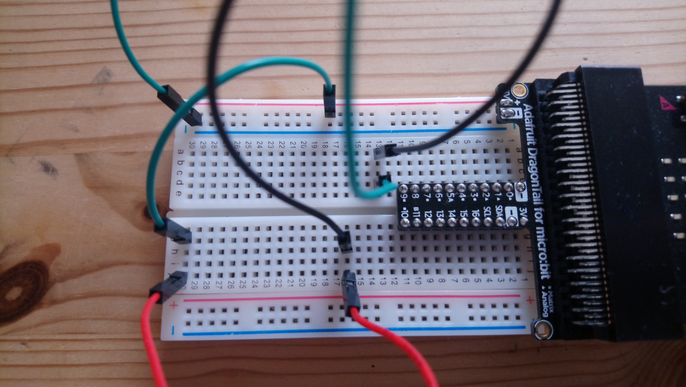

## RoboML ##

A Project to use machine learning algorithms to help debuging robotics circuits. 
The goal is to predict on images of robotics circuits, using a breadboard \& mircocontroller:
1. If there is a connection running from the **+** to the **-** pole (on the breadboard).
    * If there is a connection running from one pin of the microcontroller to the ground (**-** pole).
2. Find the coordinates where the circuit is broken. 

# Data Set #
The ML models are (by now) trained on pictures of electronics circuits that use a breadboard, micro:bit and a Dragontail. The pictures are labeld for:
* __angle__ _if the pictures are taken from a __top__ or a __side__ angle_,
* __orientation__ _if the micro:bit is on the __left__ or at the __right__ side of the picture_,
* __group__ _for each setup several photos were taken (different angle/orientation), each setup gets an unique group nuber, to be able to restrict to one photo for each group in training and avoid overfitting_,
* __background__ _since the all electronic components are relatively similar, the main variance, in inference, is expected to come from the background. The label enables to check for good generalization to different backgrounds._,
* __project__ _which project is build_
  * __base__ running a wire from the **+** to the **-** pole,
  * __led__ drive a led,
  * to come: projects from the [Teknologieskolen Summer Camp](https://www.teknologiskolen.dk/summer-camp-june-17-19/),
* __y1, y2, x1, x2__ the coordinates to crop to.
* __usability__ _if the label is __ok__ it is humanly possible to determine if the circuit is correct or not, if it is __not_ok__ the image is to blurrie or an important part is hidden behind some component, __rmv__ is to be removed from the data set_

To come:
* coordinates at which the circuit is broken.

## Example: ##

| angle | orientation | background | project | usability |
|-------|-------------|------------|---------|-----------|
| top   | R           | wood       | base    | ok        |

